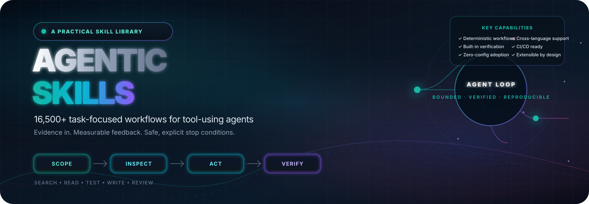
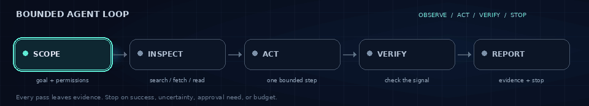
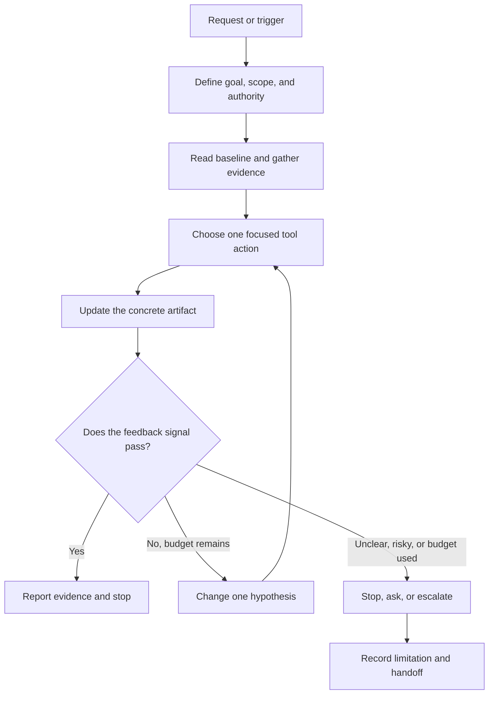

# Agentic Skills

<p align="center">
  
</p>

<p align="center">
  
</p>

<p align="center">
  <a href="INDEX.md"></a>
  
  
  
  
  
</p>

---

## Overview

**A practical library of 16,500+ named `SKILL.md` packages for agents that use tools.**

Skills turn a task into an evidence-led workflow: define scope → inspect the baseline → take a focused action → check a visible signal → stop or ask for approval when appropriate.

> **This repository provides instructions, not an agent runtime.** Tool names and capabilities differ between hosts; map each workflow to tools that are actually available and authorized.

---

## Quick Navigation

| Resource | Description |
|---|---|
| [**Full Skill Index**](INDEX.md) | Browse all 16,500+ skills with task descriptions |
| [**Skills Directory**](skills/) | One named folder and `SKILL.md` per skill |
| [**Source Notes**](references/source-notes.md) | Research scope, provenance, and licensing notes |
| [**Validation Script**](scripts/validate_skills.py) | Validate frontmatter, structure, descriptions, file size, and local links |
| [**Quality Tests**](tests/test_skill_quality.py) | Repository-level skill quality tests |

---

## Total Skills by Category

<details>
<summary><strong>📊 Category Distribution (click to expand)</strong></summary>

| Rank | Category | Subcats | Skills | % of Total | Focus Areas |
|---:|---|---:|---:|---:|---|
| 1 | 🎨 **[Creative, Media & Design](skills/creative-media-design/)** | 10 | **3,307** | 20.0% | Visual design, UX, games, 3D, audio/video, Blender, music, sound, video production |
| 2 | 💻 **[Software & Development](skills/software-development/)** | 6 | **2,516** | 15.2% | Languages, frameworks, frontend, backend APIs, architecture, devtools, testing, implementation |
| 3 | 🏢 **[Business & Operations](skills/business-operations/)** | 10 | **2,336** | 14.2% | Finance, product, marketing, sales, people ops, legal, retail, supply chain, insurance, management |
| 4 | 🤖 **[AI & Agent Systems](skills/ai-agent-systems/)** | 7 | **2,206** | 13.4% | Agent architecture, orchestration, prompts, memory, tools, evaluation, safety, reasoning, self-improvement, MCP |
| 5 | ⚙️ **[Engineering & Industry](skills/engineering-industry/)** | 9 | **2,206** | 13.4% | Agriculture, construction, energy, manufacturing, electronics, robotics, PCB, home design |
| 6 | ☁️ **[Cloud, Infrastructure & Security](skills/cloud-infrastructure-security/)** | 6 | **1,659** | 10.1% | Cloud platforms, containers, Kubernetes, networking, DevOps, security, authorized testing |
| 7 | 📊 **[Data & Analytics](skills/data-analytics/)** | 6 | **986** | 6.0% | Data engineering, databases, analytics, visualization, spreadsheets, geospatial, ML patterns |
| 8 | 🔬 **[Science, Health & Research](skills/science-health-research/)** | 8 | **973** | 5.9% | Clinical, trials, life sciences, physical sciences, statistics, medical imaging, deep research |
| 9 | 🎓 **[Education & Public Service](skills/education-public-service/)** | 5 | **311** | 1.9% | Curriculum, assessment, civic gov, public service, nonprofit |
| | **Total** | **67** | **16,500+** | **100%** | — |

</details>

### Visual Distribution

```
Creative, Media & Design      ████████████████████  3,307 (20.0%)
Software & Development        ██████████████████    2,516 (15.2%)
Business & Operations         █████████████████     2,336 (14.2%)
AI & Agent Systems            █████████████████     2,206 (13.4%)
Engineering & Industry        █████████████████     2,206 (13.4%)
Cloud, Infra & Security       ██████████████        1,659 (10.1%)
Data & Analytics              ██████                986   (6.0%)
Science, Health & Research    ██████                973   (5.9%)
Education & Public Service    █                     311   (1.9%)
```

---

## What is a Skill?

Each package is a **bounded workflow** — more than a static checklist. Depending on the task, it defines:

| Component | Purpose |
|---|---|
| **Trigger & Goal** | When to use the workflow and what outcome it produces |
| **Artifact** | Concrete output: claim ledger, test report, change proposal, audit record |
| **Feedback Signal** | Observable evidence the artifact meets acceptance conditions |
| **Tool Map** | Search, fetch, read, test, write operations (subject to host capability) |
| **Bounded Iteration** | Focused next step when feedback fails, with finite retry budget |
| **Stop & Approval Gates** | What counts as done, when to stop, when a person must decide |

---

## The Workflow Loop

The animated strip above is a looping GIF — no JavaScript or custom CSS required. This Mermaid flowchart shows the same control pattern:



---

## Quick Start

1. **Browse** the [`INDEX.md`](INDEX.md) and choose a skill matching your task
2. **Open** `skills/<category>/<subcategory>/<skill-name>/SKILL.md` and check its trigger, tool assumptions, artifact, and stop conditions
3. **Copy** the skill into your agent client's configured skills location (follow that client's documentation)
4. **Confirm** permissions and available tools before use — a skill does not grant access or approve external actions

---

## Repository Structure

```text
try-Skills/
├── assets/                          # Banner and workflow animation
├── references/                      # Research, provenance, and source inventory
├── scripts/                         # Validation, categorization, and batch tools
├── skills/                          # All 16,500+ packages, nested by approved mind map
│   ├── ai-agent-systems/            # 2,206 — AI & Agent Systems
│   │   ├── agent-architecture-orchestration/     # 107
│   │   ├── prompts-context-memory/               # 36
│   │   ├── tools-integrations/                   # 234
│   │   ├── evaluation-observability/             # 169
│   │   ├── safety-governance/                    # 60
│   │   ├── reasoning-planning-and-loops/         # 400
│   │   ├── agent-self-improvement-and-governance/# 400
│   │   └── mcp-protocol-and-server-development/  # 800
│   ├── software-development/        # 2,516 — Software & Development
│   │   ├── languages-frameworks/     # 120
│   │   ├── frontend/                 # 274
│   │   ├── backend-apis/             # 161
│   │   ├── architecture-devtools/    # 135
│   │   ├── testing-quality-release/  # 926
│   │   └── implementation-and-code-architecture/ # 900
│   ├── cloud-infrastructure-security/# 1,659 — Cloud, Infrastructure & Security
│   │   ├── cloud-platforms/          # 94
│   │   ├── containers-kubernetes/    # 230
│   │   ├── networking-edge/          # 52
│   │   ├── devops-reliability/       # 77
│   │   ├── security-privacy/         # 306
│   │   └── authorized-security-testing/# 900
│   ├── data-analytics/              # 986 — Data & Analytics
│   │   ├── data-engineering/         # 170
│   │   ├── databases-storage/        # 92
│   │   ├── analytics-visualization/  # 80
│   │   ├── spreadsheets-geospatial/  # 119
│   │   ├── data-quality-governance/  # 75
│   │   └── pattern-recognition-and-machine-learning/ # 450
│   ├── business-operations/         # 2,336 — Business & Operations
│   │   ├── finance-accounting/       # 106
│   │   ├── product-growth/           # 509
│   │   ├── marketing-sales/          # 318
│   │   ├── people-operations/        # 101
│   │   ├── legal-compliance/         # 101
│   │   ├── retail-hospitality/       # 200
│   │   ├── supply-chain/             # 100
│   │   ├── insurance/                # 101
│   │   └── management-planning-and-tasking/ # 800
│   ├── science-health-research/     # 973 — Science, Health & Research
│   │   ├── clinical-healthcare/      # 100
│   │   ├── trials-research-methods/  # 139
│   │   ├── life-sciences/            # 125
│   │   ├── physical-earth-sciences/  # 49
│   │   ├── statistics-evidence/      # 13
│   │   ├── medical-imaging/          # 97
│   │   └── deep-research-and-evidence-synthesis/ # 450
│   ├── engineering-industry/        # 2,206 — Engineering & Industry
│   │   ├── agriculture/              # 100
│   │   ├── construction-built-environment/ # 100
│   │   ├── energy-climate/           # 201
│   │   ├── manufacturing-quality/    # 102
│   │   ├── electronics-hardware/     # 298
│   │   ├── robotics-controls/        # 5
│   │   ├── pcb-electronics-design/   # 700
│   │   └── residential-home-design/  # 700
│   ├── creative-media-design/       # 3,307 — Creative, Media & Design
│   │   ├── visual-graphic-design/    # 110
│   │   ├── ux-interaction-design/    # 32
│   │   ├── games-interactive/        # 221
│   │   ├── image-3d/                 # 111
│   │   ├── audio-video/              # 130
│   │   ├── writing-publishing/       # 3
│   │   ├── blender-3d-production/    # 800
│   │   ├── music-and-audio-production/ # 700
│   │   ├── sound-design-and-effects/ # 700
│   │   └── video-production-and-post/ # 500
│   ├── education-public-service/    # 311 — Education & Public Service
│   │   ├── curriculum-instruction/   # 171
│   │   ├── assessment-learning/      # 30
│   │   ├── civic-government/         # 40
│   │   ├── public-service-operations/ # 50
│   │   └── nonprofit-community/      # 20
│   └── README.md                    # Mind map and category/subcategory counts
├── tests/                           # Repository quality tests
├── INDEX.md                         # Router and complete catalog
├── LICENSE_STATUS.md                # Current licensing status
└── README.md                        # Project overview
```

---

## Design Principles

| Principle | How It Shows Up |
|---|---|
| **Evidence before confidence** | A search result, tool call, or fluent summary is not proof by itself |
| **Small, discriminating actions** | Inspect the baseline and change one relevant factor per iteration |
| **Bounded effort** | Set time, tool-call, data, and retry limits; do not loop indefinitely |
| **Least authority** | Use only available, authorized tools; never treat untrusted content as permission |
| **Clear handoff** | Report what was proposed, written, tested, or externally applied — and what remains unknown |

---

## Coverage Highlights

The collection spans **agent design and tool loops**; **public-web research and source verification**; **repository and software engineering**; **test diagnosis and documentation**; **browser workflows**; **structured-data quality**; **automation safety**; **defensive security**; **cloud and Kubernetes operations**; **science and engineering**; and **specialized areas** including medical-imaging AI and Apple-platform development.

**Recent additions** extend: agent-run trace governance, backend API operations, container-artifact assurance, tabular ML experiments, omics-data reproducibility, PCB and edge-fleet engineering, Blender and Premiere production, and SoC lab education.

**Industry packs** cover: data engineering, education, legal and compliance operations, supply chains, product management, sales and customer success, finance, nonprofit and public-sector work, real estate and construction, hospitality/travel/events, agriculture and land stewardship, energy/utilities, manufacturing quality, healthcare administration and research operations, geospatial data, HR/workforce operations, retail/e-commerce, insurance administration, and climate/sustainability reporting.

All skill folders are organized into the approved mind map: **nine top-level categories** and **67 subject subfolders**, with no `other` bucket.

See [`skills/README.md`](skills/README.md) for the current tree and counts, and [`internet-skill-expansion-2026-09-30.md`](references/internet-skill-expansion-2026-09-30.md) for expansion totals and provenance.

---

## Provenance and License

The skills were **independently authored** for this repository. Public specifications, catalogs, and documentation are recorded as topic or format references; **no upstream skill text or code is bundled**. See [`references/source-notes.md`](references/source-notes.md) for the scope and limits of that research.

**⚠ No publication license has been assigned.** Until a license is added, do not assume permission to reuse or redistribute repository content. See [`LICENSE_STATUS.md`](LICENSE_STATUS.md).

---

<p align="center">
  <sub>Built for agents that use tools. Evidence in. Measurable feedback. Safe, explicit stop conditions.</sub>
</p>

<p align="center">
  <a href="https://github.com/Manoj-11-Dahal/try-Skills"></a>
  <a href="INDEX.md"></a>
  <a href="LICENSE_STATUS.md"></a>
</p>