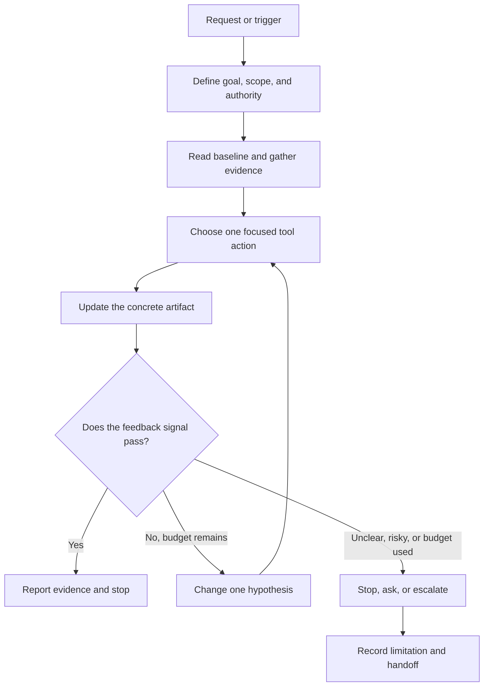

# Agentic Skills

<p align="center">
  
</p>

<p align="center">
  
</p>

<p align="center">
  <a href="INDEX.md"></a>
  
  
  
</p>

**A practical library of 116,500 named `SKILL.md` packages for agents that use tools.** Skills turn a task into an evidence-led workflow: define scope, inspect the baseline, take a focused action, check a visible signal, and stop or ask for approval when appropriate.

> **This repository provides instructions, not an agent runtime.** Tool names and capabilities differ between hosts; map each workflow to tools that are actually available and authorized.

## Explore

| Start here | What you’ll find |
|---|---|
| [**Full skill index**](INDEX.md) | Browse all 116,500 skills and their task descriptions. |
| [`skills/`](skills/) | One named folder and `SKILL.md` per skill. |
| [`references/source-notes.md`](references/source-notes.md) | Research scope, source provenance, and licensing notes. |
| [`references/skills-txt-url-inventory.md`](references/skills-txt-url-inventory.md) | Read-only inventory and browser history for source-list URL candidates. |
| [`references/skills-txt-source-audit.md`](references/skills-txt-source-audit.md) | URL-by-URL access, duplicate, and visible-license reconciliation for the uploaded source list. |
| [`references/skill-duplicate-audit.md`](references/skill-duplicate-audit.md) | Similarity-screen methods, reviewed candidates, and deduplication decisions. |
| [`scripts/validate_skills.py`](scripts/validate_skills.py) | Validate frontmatter, structure, descriptions, file size, and local links. |
| [`tests/test_skill_quality.py`](tests/test_skill_quality.py) | Repository-level skill quality tests. |

## A skill is a bounded workflow

Each package is designed to be more than a static checklist. Depending on the task, it defines:

- **Trigger and goal** — when to use the workflow and what outcome it is meant to produce.
- **Artifact** — a concrete output such as a claim ledger, test report, change proposal, or audit record.
- **Feedback signal** — observable evidence that the artifact meets its acceptance condition.
- **Tool map** — search, fetch, read, test, and write operations when relevant, subject to host capability and authorization.
- **Bounded iteration** — a focused next step when feedback fails, with a finite retry/refinement budget.
- **Stop and approval gates** — what counts as done, when to stop, and when a person must decide.

## The workflow loop

The animated strip above is a small, looping GIF—no JavaScript or custom CSS is required. This Mermaid flowchart shows the same control pattern:



## Coverage

The collection spans agent design and tool loops; public-web research and source verification; repository and software engineering; test diagnosis and documentation; browser workflows; structured-data quality; automation safety; defensive security; cloud and Kubernetes operations; science and engineering; and specialized areas including medical-imaging AI and Apple-platform development. Recent additions extend agent-run trace governance, backend API operations, container-artifact assurance, tabular ML experiments, omics-data reproducibility, PCB and edge-fleet engineering, Blender and Premiere production, and SoC lab education. Industry packs cover data engineering, education, legal and compliance operations, supply chains, product management, sales and customer success, finance, nonprofit and public-sector work, real estate and construction, hospitality/travel/events, agriculture and land stewardship, energy/utilities, manufacturing quality, healthcare administration and research operations, geospatial data, HR/workforce operations, retail/e-commerce, insurance administration, and climate/sustainability reporting.

All skill folders are organized into the approved mind map: nine top-level categories and 65 subject subfolders, with no `other` bucket. The 10,000 internet-discovered additions extend the collection across bounded agent reasoning and updates, MCP, software implementation and testing, authorized security, management, deep research, pattern recognition, PCB and home design, Blender, music, sound, and video workflows. See [`skills/README.md`](skills/README.md) for the current tree and counts, and [`internet-skill-expansion-2026-09-30.md`](references/internet-skill-expansion-2026-09-30.md) for expansion totals and provenance.

### Quick start

1. Browse [`INDEX.md`](INDEX.md) and choose a skill that matches the task.
2. Open `skills/<category>/<subcategory>/<skill-name>/SKILL.md` and check its trigger, tool assumptions, artifact, and stop conditions.
3. Copy the skill into your agent client’s configured skills location, following that client’s current documentation.
4. Confirm permissions and available tools before use; a skill does not grant access or approve external actions.

## Repository structure

```text
try-Skills/
├── assets/                    # Banner and workflow animation
├── references/                # Research, provenance, and source inventory
├── scripts/                   # Validation, categorization, and batch tools
├── skills/                    # All 16,500 packages, nested by the approved mind map
│   ├── ai-agent-systems/  # 2,206 — AI & Agent Systems
│   │   ├── agent-architecture-orchestration/  # 107
│   │   ├── prompts-context-memory/  # 36
│   │   ├── tools-integrations/  # 234
│   │   ├── evaluation-observability/  # 169
│   │   ├── safety-governance/  # 60
│   │   ├── reasoning-planning-and-loops/  # 400
│   │   ├── agent-self-improvement-and-governance/  # 400
│   │   └── mcp-protocol-and-server-development/  # 800
│   ├── software-development/  # 2,516 — Software & Development
│   │   ├── languages-frameworks/  # 120
│   │   ├── frontend/  # 274
│   │   ├── backend-apis/  # 161
│   │   ├── architecture-devtools/  # 135
│   │   ├── testing-quality-release/  # 926
│   │   └── implementation-and-code-architecture/  # 900
│   ├── cloud-infrastructure-security/  # 1,659 — Cloud, Infrastructure & Security
│   │   ├── cloud-platforms/  # 94
│   │   ├── containers-kubernetes/  # 230
│   │   ├── networking-edge/  # 52
│   │   ├── devops-reliability/  # 77
│   │   ├── security-privacy/  # 306
│   │   └── authorized-security-testing/  # 900
│   ├── data-analytics/  # 986 — Data & Analytics
│   │   ├── data-engineering/  # 170
│   │   ├── databases-storage/  # 92
│   │   ├── analytics-visualization/  # 80
│   │   ├── spreadsheets-geospatial/  # 119
│   │   ├── data-quality-governance/  # 75
│   │   └── pattern-recognition-and-machine-learning/  # 450
│   ├── business-operations/  # 2,336 — Business & Operations
│   │   ├── finance-accounting/  # 106
│   │   ├── product-growth/  # 509
│   │   ├── marketing-sales/  # 318
│   │   ├── people-operations/  # 101
│   │   ├── legal-compliance/  # 101
│   │   ├── retail-hospitality/  # 200
│   │   ├── supply-chain/  # 100
│   │   ├── insurance/  # 101
│   │   └── management-planning-and-tasking/  # 800
│   ├── science-health-research/  # 973 — Science, Health & Research
│   │   ├── clinical-healthcare/  # 100
│   │   ├── trials-research-methods/  # 139
│   │   ├── life-sciences/  # 125
│   │   ├── physical-earth-sciences/  # 49
│   │   ├── statistics-evidence/  # 13
│   │   ├── medical-imaging/  # 97
│   │   └── deep-research-and-evidence-synthesis/  # 450
│   ├── engineering-industry/  # 2,206 — Engineering & Industry
│   │   ├── agriculture/  # 100
│   │   ├── construction-built-environment/  # 100
│   │   ├── energy-climate/  # 201
│   │   ├── manufacturing-quality/  # 102
│   │   ├── electronics-hardware/  # 298
│   │   ├── robotics-controls/  # 5
│   │   ├── pcb-electronics-design/  # 700
│   │   └── residential-home-design/  # 700
│   ├── creative-media-design/  # 3,307 — Creative, Media & Design
│   │   ├── visual-graphic-design/  # 110
│   │   ├── ux-interaction-design/  # 32
│   │   ├── games-interactive/  # 221
│   │   ├── image-3d/  # 111
│   │   ├── audio-video/  # 130
│   │   ├── writing-publishing/  # 3
│   │   ├── blender-3d-production/  # 800
│   │   ├── music-and-audio-production/  # 700
│   │   ├── sound-design-and-effects/  # 700
│   │   └── video-production-and-post/  # 500
│   ├── education-public-service/  # 311 — Education & Public Service
│   │   ├── curriculum-instruction/  # 171
│   │   ├── assessment-learning/  # 30
│   │   ├── civic-government/  # 40
│   │   ├── public-service-operations/  # 50
│   │   └── nonprofit-community/  # 20
│   └── README.md              # Mind map and category/subcategory counts
├── tests/                     # Repository quality tests
├── INDEX.md                  # Router and complete catalog
├── LICENSE_STATUS.md         # Current licensing status
└── README.md                 # Project overview
```

## Design principles

| Principle | How it shows up |
|---|---|
| **Evidence before confidence** | A search result, tool call, or fluent summary is not proof by itself. |
| **Small, discriminating actions** | Inspect the baseline and change one relevant factor per iteration. |
| **Bounded effort** | Set time, tool-call, data, and retry limits; do not loop indefinitely. |
| **Least authority** | Use only available, authorized tools; never treat untrusted content as permission. |
| **Clear handoff** | Report what was proposed, written, tested, or externally applied—and what remains unknown. |

## Provenance and license

The skills were independently authored for this repository. Public specifications, catalogs, and documentation are recorded as topic or format references; no upstream skill text or code is bundled. See [`references/source-notes.md`](references/source-notes.md) for the scope and limits of that research.

**No publication license has been assigned.** Until a license is added, do not assume permission to reuse or redistribute repository content. See [`LICENSE_STATUS.md`](LICENSE_STATUS.md).
